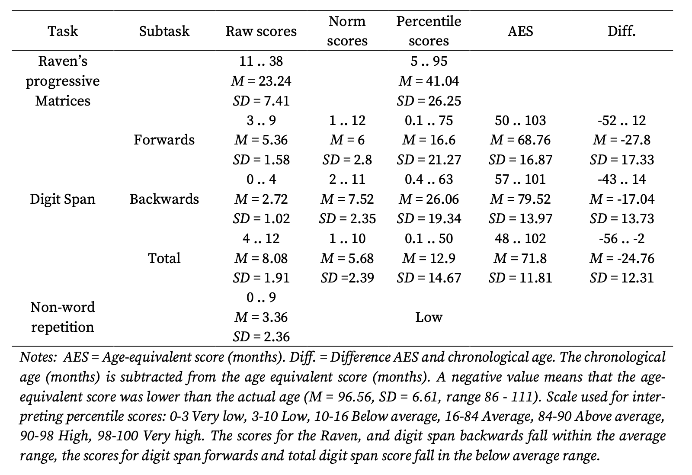

The final work is the Rmd file named "data-analysis-replication.Rmd." The html file is just committed for reference.

Before we get started:

Here are some "housekeeping" chunks. 
```{r, echo=FALSE, include=FALSE}
knitr::opts_chunk$set(echo = TRUE)
#knitr::include_graphics("images/imagename.filetype") #I am more used to another way to insert figures.
```

In this way, the packages needed should be installed before the require() function. I deleted some of the packages that I thought I would use but I didn't. Just in case: the earlier full list is c("tidyverse", "dplyr", "mosaic", "ggplot2", "infer", "skimr", "cowplot", "broom", "car", "jtools", "naniar", "MuMIn", "lme4", "lmerTest", "lmtest", "broom.mixed")
```{r}
pkg <- c("tidyverse", "dplyr", "ggplot2", "lme4", "broom.mixed")
not_installed <- pkg[!pkg %in% rownames(installed.packages())]
if (length(not_installed) > 0) install.packages(not_installed) 

lapply(pkg, require, character.only = TRUE)
```

# Introduction
This is a journal article written by three researchers from University of Amsterdam, the Netherlands (Broedelet et al., 2023). It is named "Broedelet et al., 2023" in the repository/folder. Hereby, all "section" and "subsection" refers to the portions in the original article, whereas "Figure" and "Table" refer to the ones with titles in this Rmd/html file.

The study asks two major research questions. 

- The **first** research question question (RQ1): "Are children with developmental language disorder (DLD) less sensitive to distributional cues compared to TD children when learning novel visual object categories in an experiment?" 
- The **second** question (RQ2): "Does the ability of visual distributional learning contribute to lexical knowledge in children with DLD?"


Here are some terms to clarify (from both the article and me): 

- **DLD**: DLD is a communication disorder that interferes with learning, understanding, and using language. More information can be found here https://www.nidcd.nih.gov/health/developmental-language-disorder. The descriptive picture for the causes and symptoms for this disorder is not yet very clear, so a wide variety of researches focuses on the population with DLD and study their abilities across all linguistic domains and other related areas, in most of the cases, in comparison to typically developing (TD) children. In this paper, their object was to study the role ("nature and extent") of statistical learning in lexical-semantic development. In the field of Linguistics, how humans acquire their first languages is also one of the biggest puzzles. Studies on pathology and populations with language impairment, in turn, throw light on the question for those who are interested in this topic.

- **Lexical-semantics**: Semantic is a linguistic domain of language meanings, and lexical-semantics is a sub-field of word meanings.

- **Distributional learning (distributional cues/visual distributional learning)**: Some think to recognize is to categorize (e.g., Harnad et al., 2005). "Distributional learning is a form of statistical learning and entails the learning of categories based on the frequency distribution of variants in the environment." The article specifies "a visual distributional learning task based on Junge et al. (2018) to test novel object categorization in children with and without DLD." 

Two txt format data files were published by the researchers. I saved two files as csv files. Each file targets at one research question.
```{r}
df_Q1 <- read_csv("./data/CAT_Test.csv", col_names = TRUE)
df_Q2 <- read_csv("./data/CAT_regr.csv", col_names = TRUE)
```

Now we have some ideas on most of the variables involved to answer RQ1 and RQ2. The ones involved my replication are:

RQ1:

- `Group`: Researchers got a final sample of 25 children with DLD. 25 TD children were matched from a larger sample from previous studies where data were already collected. The children with DLD "were recruited via different institutions in the Netherlands;" the TD children were recruited from two primary schools. Their recruitment criteria are quite standard to my knowledge. For more details, please see subsection **Participants** under section **Method**from the article. This is a categorical variable

- `Condition`: Figure 1 demonstrate the experimental design. Participants will get familiarized with a continuum of tokens. The frequency distribution of each token are plotted in Figure 1. Each participant will be assigned to either Condition 1 (Blue) or Condition 2 (Orange). Token 4, Token 6 and Token 8 were named D1 (Deviant 1), S (Standard) and D2 (Deviant 2). For a participant who is sensitive to frequency distributional cues, they will choose that D1 and S are more alike if assigned Condition 1, and S and D2 are more alike if assigned Condition 2, due to the different arrangement of the category boundary. This is also a categorical variable.

- `Age_months`: This variable is inherently treated as a predictor variable in this type of study. In this study, it is treated as a continuous variable.

- `AnswerStimD2`: This is the dependent variable, i.e., choice made by participants in the tasks after familiarization with either condition. This variable, relative to `Condition`, depicts the distributional learning ability. This variable is in the format of binomial counts. The nature of this variable determines that for RQ1, I will likely choose `glmer(family = "binomial")` for the inferential analysis replication.

- `PositionD2`: They suspect when participants made the choice, whether D2 token was presented on the left or right (see Figure 2) on the screen might affect their choice preference, so they added this categorical variable as the random factor.

- `Subject`: This vairable is inherently treated as a random factor in this type of study.

The head() function allows us to get an overview of the dataset structure and examine all the variables as the column names
```{r}
head(df_Q1)
```


RQ2:

- `DLMeanAccuracy`: Different from RQ1, they use accuracy (range from 0-1) based on participants' choices to represent the distributional learning ability (e.g., choosing D1 in a test question if assigned Condition 1 is considered accurate). It's a transformation of earlier data (Condition, AnswerStimD1 and AnswerStimD2).

- **Children with DLD’s scores on various tasks**: The study did many multiple regression analyses on multiple areas of abilities with different components (scores). 

```{r}
head(df_Q2)
```

For RQ1, they did three major analyses other than descriptive data presentation and visulizations. They are: "**Split-half reliability distributional learning task**,"**Group comparison distributional learning task**" and "**Exploratory results**." The results are listed in several sub-sections under section **Results**. I only replicate the descriptive data visualization for RQ1 (participants' choices under different conditions) and the second analysis, which is the most essential analysis to my judgment. In the first analysis, they concluded that the task is a reliable test. In the second analysis, they found that "school-aged children can learn novel visual object categories based on distributional properties," but they couldn't conclude "whether children with DLD do or do not have a distributional learning deficit." I will replicate this analysis in addition to the visualization. In the third analysis, they only include children with DLD but couldn't conclude whether children with DLD are able to learn novel visual object categories based on distributional information.

For RQ2, their dataset file only include children with DLD and their performance across multiple areas. They present the results of "four separate multiple linear regression analyses in R to test the relationship between distributional learning and different measures of vocabulary." as well as some descriptive data/visualizations in subsection **Regression analyses** in section **Results**. I only replicate the descriptive data analyses and visualizations.

# Visualization of Data
## RQ1
Here is the visualization for RQ1.


I recoded the column `AnswerStimD2` to enable `y = count` in ggplot.
```{r}
df_Q1_visual <- df_Q1 %>% 
  mutate(AnswerStimD2 = case_when(AnswerStimD2 == 0 ~ "D1",
                       AnswerStimD2 == 1 ~ "D2")) %>%
  group_by(Group, Condition, AnswerStimD2) %>% 
  summarise(count = n())
```

Here is my replication for Figure 3.
```{r}
ggplot(df_Q1_visual, aes(x = factor(Condition), y = count, fill = factor(AnswerStimD2))) +
  geom_bar(stat="identity") +
  labs(x = "Condition", y = "Count", fill = "Answer") +
  theme_minimal() +
  facet_wrap(~Group)
```

Figure 3 is replicable and we can see that choice counts for D1 and D2 depending on condition and group are same in two figures. From the visualization, at least I have a sense that school-age children do make some different choices (i.e. being sensitive to ) based on conditions.

## RQ2

- `DLMeanAccuracy`
Here is the visualization for `DLMeanAccuracy`.


Here is my replication for Figure 4.
```{r}
ggplot(df_Q2, aes(x=DLMeanAcc)) +
  geom_histogram(position="dodge")+
  theme(legend.position="top")+
  labs(x = "Accuracy", y = "Count")
```

Again, we see Figure 4 is replicable. One take-away message from Figure 4 is that the DLD group may not perform as bad as we might expected.

- **Children with DLD’s scores on various tasks**
Here are two tables with other descriptive data (scores of multiple tests)




Here is my replication:

For a better visualization, I rename the column names to make the output more readable.
```{r}
df_Q2_desc <- df_Q2
colnames <- c("Subject", "Accuracy", "Age months", "Productive vocabulary", "Digit span forwards", "Digit Span Backwards", "Digit span total", "Non-word repetition", "Receptive vocabulary", "Raven’s progressive matrices", "Word associations", "Word classes receptive", "Word classes expressive", "Word classes total")
colnames(df_Q2_desc) <- colnames
```

Then I use pivot_longer() to enable summarise(). Column names go under "Task" and test scores go under "Score."
```{r}
df_Q2_desc <- df_Q2_desc %>%
  pivot_longer(cols = c("Productive vocabulary", "Digit span forwards", "Digit Span Backwards", "Digit span total", "Non-word repetition", "Receptive vocabulary", "Raven’s progressive matrices", "Word associations", "Word classes receptive", "Word classes expressive", "Word classes total"), names_to = "Task", values_to="Score")
  

```

The columns of the tables I summarised are mean, standard deviation and the ranges following the column names of Table 1 and Table 2. Some elements in Table 1 and Table 2 are missing. For example, age-equivalent scores are corresponding scores on the test manuals (or other form of the norms) to look up, and those data were not included in the shared dataset. For almost all test scores, raw scores were used in further regression analyses, so those data are available in the dataset, but for there are three exceptions as explained in the original paper, For those three scores, norm scores instead of raw scores are available. I added one column in the replication to specify what type of score is available. Data from two tables (Table 1 and Table 2) are included. I added one column to specify the test category (vocabulary or control).
```{r}
df_Q2_desc_sum <- df_Q2_desc %>%
  group_by(Task) %>%
  summarise(M = mean(Score), SD = sd(Score), Range = paste0(min(Score), "..", max(Score))) %>%
  mutate(Score_type = case_when(Task %in% c("Productive vocabulary", "Digit span forwards", "Digit Span Backwards", "Digit span total", "Non-word repetition", "Receptive vocabulary", "Raven’s progressive matrices", "Word associations") ~ "Raw",
                       Task %in% c("Word classes receptive", "Word classes expressive", "Word classes total") ~ "Norm"))%>%
  mutate(Task_type = case_when(Task %in% c("Productive vocabulary", "Receptive vocabulary", "Word associations", "Word classes receptive", "Word classes expressive", "Word classes total") ~ "vocabulary",
                       Task %in% c("Raven’s progressive matrices", "Digit span forwards", "Digit Span Backwards", "Digit span total", "Non-word repetition") ~ "control")) %>%
  arrange(Task_type, Score_type)

df_Q2_desc_sum
```
Among the available data, the replication is accurate compared to Table 1 and Table 2.

# Statistical Replications/Reanalysis
I replicated the second analysis "**Group comparison distributional learning task**."

Here is a thorough description from the article in Figure 5


As earlier stated, the core function should be glmer() due to the nature of the dependent variable. We don't have to do the first step as in the available dataset, as fillers and practices were already removed. I first processed several involved categories with as.factor() so the numeric information in Subject wouldn't interfere with the formula, and variables are ready for further sum-to-zero orthogonal coding.
```{r}
df_Q1_inf <- df_Q1 %>%
  mutate(Condition = as.factor(Condition),
         Group = as.factor(Group),
         PositionD2 = as.factor(PositionD2),
         Subject = as.factor(Subject))
str(df_Q1_inf)
```

It would be handy to print the original levels of these three variables before we set out to do the sum-to-zero orthogonal coding.
```{r}
print(c(levels(df_Q1_inf$Condition), levels(df_Q1_inf$Group), levels(df_Q1_inf$PositionD2)))
```

The way I do sum coding follows the suggestions in Figure 6. The suggestions were from ChatGPT and the conversation link is provided by one of my mentors for another project.


According to the suggestion, this is what I will do.
```{r}
contrasts(df_Q1_inf$Condition) <- contr.sum(2)
contrasts(df_Q1_inf$Group) <- contr.sum(2)
contrasts(df_Q1_inf$PositionD2) <- contr.sum(2)
```

But Figure 5 specified further details on the contrasts. In the following chunks I followed the instructions to replicate the details. These are the products of the previous chunk for `Condition`
```{r}
contrasts(df_Q1_inf$Condition)
```

Here are the adjusted ones.
```{r}
contrasts(df_Q1_inf$Condition)[,1] = c(0.5, -0.5)
contrasts(df_Q1_inf$Condition)
```

Same for other variables.
```{r}
contrasts(df_Q1_inf$Group)
```

```{r}
contrasts(df_Q1_inf$Group)[,1] = c(-0.5, 0.5)
contrasts(df_Q1_inf$Group)
```

```{r}
contrasts(df_Q1_inf$PositionD2)
```

```{r}
contrasts(df_Q1_inf$PositionD2)[,1] = c(0.5, -0.5)
contrasts(df_Q1_inf$PositionD2)
```

The processing for `Age_months` is a bit different, but the idea is the same.
```{r}
head(df_Q1_inf$Age_months <- scale(df_Q1_inf$Age_months, scale=FALSE))
```

Then I write out the model (especially the formula) based on the description in Figure 6.
```{r}
m_inf_0 <- glmer(AnswerStimD2~Condition*Group*Age_months + Condition*PositionD2 + (1|Subject) + (PositionD2|Subject) , data=df_Q1_inf, family = "binomial")

summary(m_inf_0)
```
Starting from the scratch, I've seen two types of warning:

- Warning: unable to evaluate scaled gradientWarning: Model failed to converge: degenerate  Hessian with 1 negative eigenvalues
- Warning in checkConv(attr(opt, "derivs"), opt$par, ctrl = control$checkConv, : unable to evaluate scaled gradient

The Estimates from this model doesn't seem to be correct either. So I searched for some info and added an optimizer based on the suggestions from https://stats.stackexchange.com/questions/164457/r-glmer-warnings-model-fails-to-converge-model-is-nearly-unidentifiable

```{r}
m_inf <- glmer(AnswerStimD2~Condition*Group*Age_months + Condition*PositionD2 + (1|Subject) + (PositionD2|Subject) , data=df_Q1_inf, family = "binomial", glmerControl(optimizer="bobyqa", optCtrl=list(maxfun=100000)))

summary(m_inf)
```
There is still a warning, but the later replication analyses yield same results as the original article results, so I decided to just keep it here.

The first prediction that they made for RQ1 is that school-aged children should demonstrate distributional learning ability, which should "manifest as a significant effect of Condition on the dependent variable." See Figure 7.


Here are the confirmatory results. See Figure 8.


Their interpretation focuses on the odds ratio change. To calculate the ORchange for `Condition1`, I tried to extract the estimate for `Condition1`. See https://difiore.github.io/ada-2024/23-module.html. Instead of `$coefficients`, I used fixef() as suggested in https://stackoverflow.com/questions/26417005/odds-ratio-and-confidence-intervals-from-glmer-output. In the same link, I got a line of code to generate the confidence intervals.
```{r}
(ORchange_1 <- exp(fixef(m_inf)[2]))
```

```{r}
CI_1 <- tidy(m_inf,conf.int=TRUE,exponentiate=TRUE,effects="fixed")
CI_1 %>%
  filter(term == "Condition1") %>%
  select(conf.low, conf.high)
```
Thus, we replicated the results that "children in Condition 1 were 4.04 times more likely to choose stimulus D2 than children in Condition 2, and this effect was significantly above 1: z = 2.758, p = 0.006." This is in line with their prediction.

For the second condition, I repeated the similar process.
```{r}
(ORchange_2 <- exp(fixef(m_inf)[6]))
```

```{r}
CI_2 <- tidy(m_inf,conf.int=TRUE,exponentiate=TRUE,effects="fixed")
CI_2%>%
  filter(term == "Condition1:Group1") %>%
  select(conf.low, conf.high)
```
Thus we replicated the results that "although the effect of Condition was 1.007 times stronger in the TD group compared to the DLD group, this interaction between Condition and Group was not significantly above 1: z = 0.007, p = 0.994, 95% CI 0.15 .. 6.8." Their second prediction is not confirmed.
```{r}
(1/0.1499334) #conf.low
```
With this simple calculation we also replicated that "the confidence interval tells us that children with DLD could be up to 6.7 times better or 6.8 times weaker on the visual distributional learning task than TD children." They couldn't "conclude whether children with DLD do or do not have a distributional learning deficit."

Here is a table of summarization for the results for two predictions.
```{r}
df_Q1_inf_sum <- tidy(m_inf,conf.int=TRUE,exponentiate=TRUE,effects="fixed")
df_Q1_inf_sum %>%
  filter(term == "Condition1" | term == "Condition1:Group1") %>%
  select(term, estimate, p.value, conf.low, conf.high)
```
# Summary/Discussion

According to the replication portion I did, I think the overall process is very successful. The descriptive statistical analysis and two visualizations all match the presentations in the article. 

One minor problem from the descriptive statistical analysis is that for many scores, the full data for norm scores are not available (not used in further analyses and thus not included in the data file), so some elements in Table 1 and Table 2 were missing in the replication, resulting in some missing interpretations which are present in the article. Simple raw scores do not allow us to compare between children with DLD to the norms and between areas of abilities.

The biggest problem that I encounter is in the inferential statistical analysis for RQ1, where I have to reconstruct the formula and additional arguments in my code chunk as the formula was not listed and some details were still missing. They didn't provide the details of using an optimizer (the replicated results indicate they did). I get a random piece of code resorting to stackexchange in response to the warning and mismatched results, and wasn't confident in that. Although the nature of the assignment determines that formula being unavailable in the article is a good thing, but for replication (including design replication) purpose, it might be beneficial for the researchers to list the formula for others to take as reference and design similar experiments and analysis protocols. Overall, although the formula and other arguments to place in glmer() function wasn't directly available, the researchers did provide very thorough descriptions on variables and effects, as well as how they apply sum-to-zero orthogonal coding. These details are extremely helpful. The paragraph in Figure 5 provides me with a good example in my future writing. Although I replicated the results presented in the original paper for the single inferential analysis I picked, I am still less confident in using the sum coding as described in the article and the interpretation (of what is set as the reference level).

The replicated results are quite expected from an academic perspective. The profiles of children with DLD could be highly variable. The nature of this diagnosis and the population might explains Figure 4 (widely distributed accuracy ranging from 0-1 in the sample) as well as other non-conclusions from the study.

# References
## Websites:
- https://difiore.github.io/ada-2024/23-module.html
- https://difiore.github.io/ada-2024/24-module.html
- https://stackoverflow.com/questions/26417005/odds-ratio-and-confidence-intervals-from-glmer-output
- https://stats.stackexchange.com/questions/164457/r-glmer-warnings-model-fails-to-converge-model-is-nearly-unidentifiable
- https://www.nidcd.nih.gov/health/developmental-language-disorder

## Publications:
- Broedelet, I., Boersma, P., & Rispens, J. (2023). Distributional learning of novel visual object categories in children with and without developmental language disorder. Lang. Develop. Res, 2, 1-43.
- Harnad, S., Cohen, H., & Lefebvre, C. (2005). Handbook of categorization in cognitive science. Oxford: Elsevier, chapter Cognition is categorization. Hayes, BP (1980). A metrical theory of stress rules. Massachusetts Institute of Technology. Heald, SL, Van Hedger, SC, & Nusbaum, HC (2017). Perceptual plasticity for auditory object recognition. Frontiers in Psychology, 8(781), 131-138.
- Junge, C., van Rooijen, R., & Raijmakers, M. (2018). Distributional information shapes infants’ categorization of objects. Infancy, 23(6), 917-926.